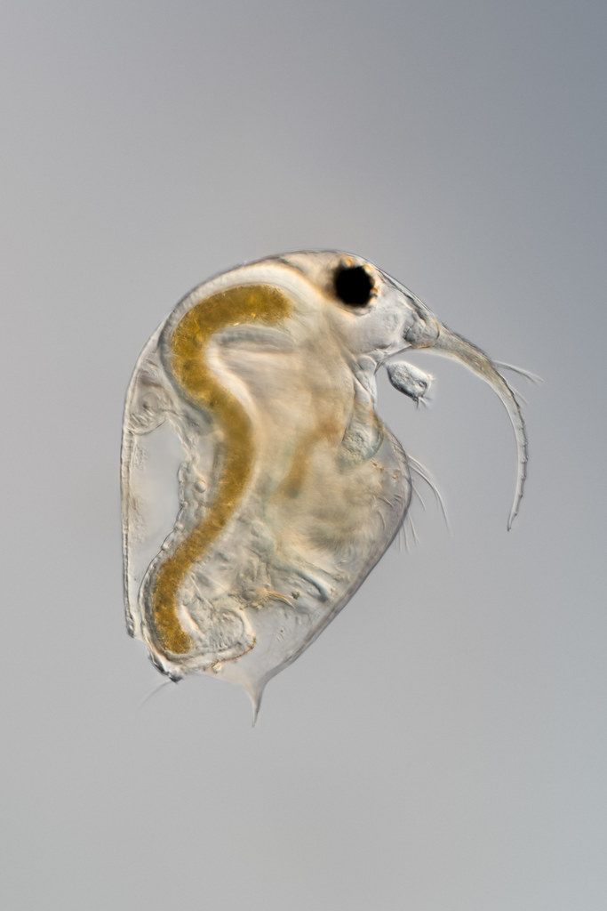
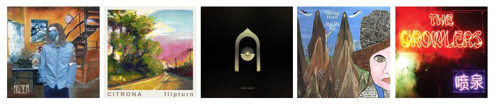
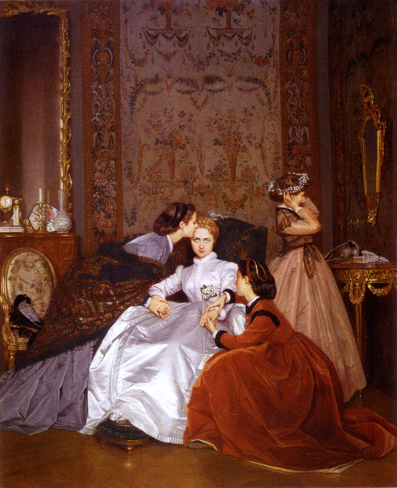
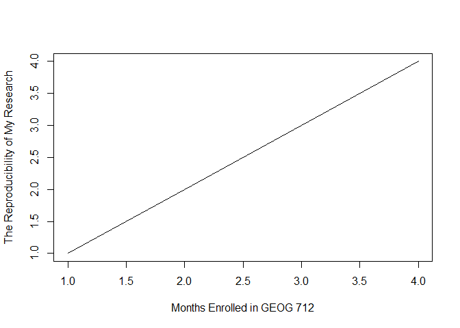

# Claire Estey’s GEOG 712 Repository

------------------------------------------------------------------------

This README document is for my first repository in GEOG 712. Within the
repository, the file organization is as follows:

| File Name    | Contents                                     |
|--------------|----------------------------------------------|
| **data_raw** | raw, unprocessed data saved as .csv files    |
| **data**     | manipulated data saved as .csv files         |
| **figures**  | saved figures and plots I generate           |
| **images**   | .jpg files to be inserted into the documents |
| **tables**   | saved output tables I generate               |

# My Research Interests

------------------------------------------------------------------------

For my MSc research, I am looking at the effects of **quaternary
ammonium compounds** (QACs) on the diversity, community composition, and
reproductive rates of freshwater zooplankton. Zooplankton are
micro-crustaceans that live pelagically in the water column of lakes and
oceans, typically feeding on phytoplankton or other zooplankton. QACs
are a class of high-production volume chemicals that have a wide variety
of uses, including as anti-static agents, disinfectants, and
emulsifiers. The QAC I study in particular is called **benzalkonium
chloride** (BAC) and is a potent antimicrobial compound. It’s use since
the onset of the COVID-19 pandemic has increased *drastically*,
resulting in concerning levels being found in our freshwater systems,
with unknown effects on aquatic biota.

``` r
knitr::include_graphics(paste0(here(), "/images/bosmina.jpg"))
```

<!-- -->

*Bosmina sp.*, a crustaceous zooplankton commonly found in Boreal lakes.

# Favourites

------------------------------------------------------------------------

## Favourite Music

My five favourite songs are as follows:

1.  *Jackie and Wilson* by Hozier
2.  *August* by flipturn
3.  *Heat Above* by Greta Van Fleet
4.  *And She Was* by Talking Heads
5.  *Going Gets Tough* by The Growlers

``` r
knitr::include_graphics(paste0(here(), "/images/albums.jpg"))
```

<!-- -->

## Favourite Equation

My favourite equation is the Inverse Simpson Index ($^2D$, where $S$ is
species richness and $p_i$ is the proportion of individuals belonging to
species $i$) as it is used in my research as a measure of zooplankton
community diversity:

$$
^2D = \frac{1}{\sum_{i=1}^S(p_i)^2}
$$

## Favourite Artists

| Name                   | Achievements                                                                                                                                        |
|------------------------|-----------------------------------------------------------------------------------------------------------------------------------------------------|
| **Georgia O’Keefe**    | Celebrated early twentieth century painter focusing on desert landscapes and animal skulls.                                                         |
| **Tim Gardner**        | Pastel and oil painter creating hyper-realistic depictions of everyday life in North America.                                                       |
| **Ai Weiwei**          | Contemporary artist, sculptor, and human rights activist most known for the controversial photography pieces titled *“Dropping a Han Dynasty Urn”*. |
| **Lawren Harris**      | Original Group of Seven member known for stunning Canadian landscape paintings.                                                                     |
| **Auguste Toulmouche** | Widely known nineteenth century painter and creator of one of my favourite paintings, *“The Hesitant Fiancee”*.                                     |

``` r
knitr::include_graphics(paste0(here(), "/images/hesitant_fiancee.jpg"))
```

<!-- -->

# A Chunk of Code

------------------------------------------------------------------------

``` r
x <- c(1, 2, 3, 4)
y <- c(1, 2, 3, 4)

plot(x, y, xlab = "Months Enrolled in GEOG 712", ylab = "The Reproducibility of My Research", type = "l")
```

<!-- -->
